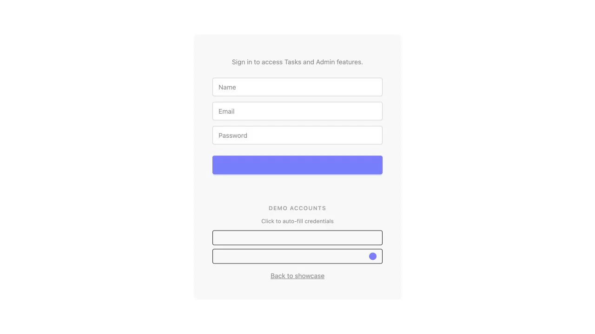

# test-hono

Hono + Datastar full-stack showcase — tri-mode deployment to Cloudflare Workers, Fly.io, and browser local-first mode. Same codebase, same 29 tests, same frontend.

**Live demo:** https://test-hono.gedw99.workers.dev (demo accounts pre-seeded)

**Local-first mode:** https://test-hono.gedw99.workers.dev/?local (runs entirely in-browser)

**repo:** https://github.com/joeblew999/test-hono

[](https://deploy.workers.cloudflare.com/?url=https://github.com/joeblew999/test-hono)

| Desktop | Tablet | Mobile |
|---------|--------|--------|
|  |  |  |

### Cross-Tab Sync Demo

Two browser tabs connected via persistent SSE — increment the counter or add a note in Tab A and watch Tab B update within 2 seconds.


### Counter

| Increment | Decrement | Set via Input |
|-----------|-----------|---------------|
|  |  |  |

| Computed Values | Color Classes | Conditional Messages |
|-----------------|---------------|----------------------|
|  |  |  |

| Inc + Dec Together | Server Fragment |
|--------------------|-----------------|
|  |  |

### Notes

| Add & Display | Add Multiple & Delete | Input Clears |
|---------------|----------------------|--------------|
|  |  |  |

| Interval Timer | Reactive Styles | Signal Inspector |
|----------------|-----------------|------------------|
|  |  |  |

### Auth & Tasks

| Sign Up | Sign In After Sign Up | Sign Out |
|---------|----------------------|----------|
|  |  |  |

| Tasks CRUD | Admin Panel | Unauthenticated |
|------------|-------------|-----------------|
|  |  |  |

### Sessions

| Session List | Unauthenticated |
|--------------|-----------------|
|  |  |

### Local-First (OPFS + Leader Election)

| Offline Mode | Persistence | Round-Trip | Sync to Server |
|--------------|-------------|------------|----------------|
|  |  |  |  |

## Features

- **Content-negotiated API** — single set of OpenAPI routes serves JSON (curl, Scalar) and SSE (Datastar) via `Accept` header
- **Tri-mode deployment** — Cloudflare Workers, Fly.io (persistent SSE), and browser local-first from one codebase
- **Zero-build frontend** — plain HTML + Datastar attributes, no JSX/bundler/virtual DOM
- **Authentication** — Better Auth with email+password, admin plugin, role-based access
- **Task management** — authenticated CRUD with status tracking (pending/in_progress/completed)
- **MCP endpoint** — 15 AI-agent tools (counter, notes, tasks, admin) via Streamable HTTP
- **Local-first mode** — wa-sqlite + OPFS with Leader Election, runs the **same OpenAPI routes** in-browser, works offline across tabs
- **Demo mode** — pre-seeded users, counter, notes, and tasks for instant exploration
- **Real-time broadcast** — persistent SSE on Fly.io pushes changes to all connected tabs
- **Multi-master sync** — Corrosion (cr-sqlite) replication across Fly.io nodes
- **29 e2e tests** — Playwright tests covering counter, notes, auth, tasks, sessions, and local-first mode

## Stack

| Layer | Technology |
|-------|-----------|
| API framework | [Hono](https://hono.dev) (OpenAPIHono) + Zod OpenAPI + [Scalar](https://scalar.com) docs |
| Frontend | [Datastar](https://data-star.dev) v1.0.0-RC.7 (self-hosted, SSE-driven) |
| Auth | [Better Auth](https://www.better-auth.com) (email+password, admin plugin) |
| ORM | [Drizzle](https://orm.drizzle.team) (auth + tasks tables) |
| Database | [Cloudflare D1](https://developers.cloudflare.com/d1/) / bun:sqlite / wa-sqlite + OPFS / [Corrosion](https://github.com/joeblew999/binary-corrosion) |
| AI integration | MCP protocol via [@hono/mcp](https://github.com/honojs/middleware/tree/main/packages/mcp) |
| Serverless | [Cloudflare Workers](https://developers.cloudflare.com/workers/) (one-shot SSE) |
| Persistent | [Fly.io](https://fly.io) + [Bun](https://bun.sh) (real-time SSE broadcast) |
| Local-first | Web Worker + wa-sqlite + OPFS (Leader Election, same OpenAPI routes) |
| Tests | [Playwright](https://playwright.dev) (29 e2e tests) |
| Task runner | [Task](https://taskfile.dev) |

## Quick Start

**Prerequisite:** install [Task](https://taskfile.dev) — everything else is handled by `task deps`.

```sh
task deps       # install Bun (if needed) + all dependencies
task dev        # start Workers dev server (port 8787)
task test       # run 29 e2e tests
```

Open http://localhost:8787 for the app, `/docs` for Scalar API docs, `/login` to sign in.

**Offline mode:** http://localhost:8787/?local

### Other modes

```sh
task fly:dev              # Bun server with persistent SSE (port 3000)
task fly:dev:corrosion    # Bun + Corrosion multi-master sync (port 3000)
task sw:dev               # build local-mode bundles + start dev server
```

## Tri-Mode Architecture

Three deployment targets from one codebase — no feature flags, no conditional imports.

| | Workers (`index.ts`) | Fly.io (`server.ts`) | Local-First (`sw/local-mode.ts`) |
|---|---|---|---|
| Runtime | Cloudflare Workers | Bun | Browser (Web Worker) |
| Database | D1 | bun:sqlite / Corrosion | wa-sqlite + OPFS |
| SSE | One-shot | Persistent (broadcast) | One-shot |
| Auth | Better Auth + D1 | Better Auth + SQLite | None (public only) |
| MCP | Yes | Yes | No |
| Offline | No | No | Yes |
| Cross-tab | D1 polling | In-memory broadcast | Leader Election + BroadcastChannel |

```
Cloudflare Workers          Fly.io / Bun               Local-First (Browser)
┌───────────────────┐    ┌───────────────────────┐    ┌────────────────────────┐
│  D1 (SQLite)      │    │  bun:sqlite / Corrosion│    │  wa-sqlite + OPFS      │
│  One-shot SSE     │    │  Persistent SSE        │    │  Leader Election       │
│  Auth + MCP       │    │  Real-time broadcast   │    │  (Web Locks API)       │
└─────────┬─────────┘    │  Auth + MCP            │    │  Cross-tab via         │
          │              └───────────┬───────────┘    │  BroadcastChannel      │
          │                          │                 └────────┬───────────────┘
          └──────────────┬───────────┴──────────────────────────┘
                         │
                ┌────────┴────────┐
                │    api.ts       │  ← shared routes + content negotiation
                │  queries.ts     │  ← shared SQL (D1 interface)
                │  index.html     │  ← shared Datastar frontend
                │  29 Playwright  │  ← shared tests
                │    tests        │
                └─────────────────┘
```

### Content negotiation

A single set of OpenAPI routes serves two audiences:

```sh
# API client gets JSON
curl -X POST http://localhost:8787/api/counter/increment
# → {"count": 3}

# Datastar frontend gets SSE (same URL, different Accept header)
# → event: datastar-patch-signals
# → data: signals {"count": 3}
```

One route definition. One Zod schema. One handler. `respond(c, data)` checks `Accept: text/event-stream` and branches.

### The D1 adapter pattern

`queries.ts` is typed for Cloudflare's `D1Database` interface. Thin adapters make other databases look like D1:

```ts
// db.ts — bun:sqlite → D1
const d1 = createD1Compat(sqliteDb)
// sw/db-coordinator.ts — wa-sqlite + OPFS → D1 (Leader Election)
const { db: d1 } = await initCoordinator()
// corrosion/db.ts — Corrosion HTTP API → D1
const d1 = initCorrosionDB(agentUrl)
```

Result: **zero changes** to `queries.ts` across all platforms.

### Real-time SSE (Fly.io only)

```
Tab A                          Bun Server                      Tab B
  │                                │                              │
  │── GET /api/counter (SSE) ─────>│                              │
  │<── event: count=0 ────────────│<── GET /api/counter (SSE) ──│
  │   (connection stays open)      │── event: count=0 ──────────>│
  │                                │                              │
  │── POST /increment ───────────>│                              │
  │<── one-shot SSE: count=1 ────│── broadcast: count=1 ──────>│
  │                                │                              │
  │   Tab A shows 1               │              Tab B shows 1   │
```

## Demo Mode

When `DEMO_MODE=true` (default), the app seeds on first request:

| Data | Content |
|------|---------|
| **Users** | `demo@example.com` / `demo1234` (user), `admin@example.com` / `admin1234` (admin) |
| **Counter** | Set to 42 |
| **Notes** | 5 helpful notes about the demo |
| **Tasks** | 4 tasks per user with mixed statuses |

All seeding is idempotent — safe on every cold start.

## Commands

```
# Development
task dev                  # Workers dev server (port 8787)
task fly:dev              # Bun server with persistent SSE (port 3000)
task fly:dev:corrosion    # Bun + Corrosion multi-master (port 3000)
task sw:dev               # build local-mode bundles + start dev server

# Testing
task test                 # 29 e2e tests headed + serial
task test:ci              # 29 e2e tests headless + parallel (CI)
task fly:test             # same tests against Bun server
task cf:test:deployed     # tests against production Workers
task fly:test:deployed    # tests against production Fly.io
task screenshots          # capture at 3 viewports (mobile/tablet/desktop)
task videos              # record test runs as GIFs (docs/videos/)
task sync-demo           # record two-tab sync demo as side-by-side GIF
task docs                # generate all docs (screenshots + videos + sync demo)

# Database
task db:migrate           # apply D1 migrations locally
task db:migrate:remote    # apply D1 migrations remotely
task db:generate          # generate migration from schema.ts changes
task db:studio            # open Drizzle Studio

# Deployment
task deploy               # deploy to Cloudflare Workers
task fly:deploy           # deploy to Fly.io
task login                # authenticate with Cloudflare
task fly:login            # authenticate with Fly.io

# Local Mode
task sw:build             # bundle local-mode.js + db-worker.js + wa-sqlite.wasm

# Corrosion
task corrosion:install    # install Corrosion binary
task corrosion:start      # start Corrosion agent
task corrosion:stop       # stop Corrosion agent

# Setup
task deps                 # install Bun + all dependencies
task cf:ci:secrets        # set Cloudflare secrets in GitHub for CI
```

## File Structure

```
# Entry points
index.ts              # Cloudflare Workers entry
server.ts             # Bun/Fly.io entry (persistent SSE)

# Route composition
api.ts                # Full route composer (counter + notes + tasks)

# Routes
routes/
  counter.ts          # Counter OpenAPI routes + handlers
  notes.ts            # Notes CRUD OpenAPI routes + handlers
  tasks.ts            # Tasks CRUD with auth middleware
  sessions.ts         # Session listing + revocation

# Core
queries.ts            # Raw D1 SQL queries (counter)
sse.ts                # SSE helpers: respond, respondFragment, respondPersistent
types.ts              # Shared types: AppEnv, BroadcastConfig
constants.ts          # API paths, DOM selectors

# Application logic
lib/
  auth.ts             # Better Auth factory + requireAuth/requireAdmin middleware
  crud.ts             # Generic CRUD factory (user-scoped)
  task-logic.ts       # Task CRUD business logic (Drizzle)
  note-logic.ts       # Note CRUD business logic (Drizzle)
  demo.ts             # Demo user + data seeding
  docs.ts             # OpenAPI doc + Scalar mount
  middleware.ts       # Error handler, 404, security headers
  mcp/                # MCP server plugins (18 tools)

# Schema
schema.ts             # Drizzle ORM table definitions (auth + tasks + notes)
validators.ts         # Zod + OpenAPI validation schemas

# Local-first mode (wa-sqlite + OPFS)
sw/
  local-mode.ts       # Entry point: Hono app + fetch handler (→ static/local-mode.js)
  db-coordinator.ts   # Leader Election via Web Locks + BroadcastChannel
  db-worker.ts        # Dedicated Worker: wa-sqlite + OPFS persistence
  api.ts              # Slim route composer (imports shared routes/counter.ts)
  seed-data.ts        # Seed data constants

# Database adapters
db/
  bun.ts              # bun:sqlite → D1 adapter
corrosion/
  db.ts               # Corrosion HTTP API → D1 adapter
  local-manager.ts    # Manages local Corrosion agent process
  sync-manager.ts     # Polls Corrosion for changes, broadcasts via SSE

# Frontend
static/
  index.html          # Datastar frontend (20 patterns, responsive)
  login.html          # Auth login/signup page
  datastar.js         # Self-hosted Datastar v1 RC.7 (+.map)
  local-mode.js       # Local mode bundle (build output, gitignored)
  db-worker.js        # DB worker bundle (build output, gitignored)
  wa-sqlite.wasm      # wa-sqlite WASM binary (copied from node_modules)

# Tests
tests/
  counter.spec.ts     # 9 counter tests
  notes.spec.ts       # 6 notes/demo tests
  auth.spec.ts        # 6 auth/tasks/admin tests
  sessions.spec.ts    # 4 sessions tests
  sw.spec.ts          # 4 local mode tests (Leader Election + OPFS)

# Config
wrangler.toml         # Cloudflare Workers config
fly.toml              # Fly.io config (includes Corrosion process)
Dockerfile            # Bun container for Fly.io
Taskfile.yml          # All dev/test/deploy commands
drizzle.config.ts     # Drizzle Kit config (points to schema.ts)
playwright.config.ts  # Playwright config
```

## Datastar Patterns Showcased

20 patterns across the index page:

| Pattern | Description |
|---------|-------------|
| `data-signals` | Reactive state store |
| `data-text` | Text binding |
| `data-on:click` | Event handlers with `@post`, `@delete`, `@get` |
| `data-init` | Initialization (fetch on load, setInterval) |
| `data-class` | Conditional CSS classes |
| `data-show` | Conditional visibility |
| `data-computed` | Derived signals (name must be lowercase) |
| `data-bind` | Two-way input binding |
| `data-attr` | Conditional HTML attributes |
| `data-effect` | Reactive side effects |
| `data-style` | Reactive inline styles |
| `data-json-signals` | Live JSON dump of all signals |
| `data-on:keydown.window` | Global keyboard listeners |
| `data-on:input__debounce.500ms` | Debounced input (RC.7 modifier syntax) |
| `datastar-patch-signals` | SSE event: update signal values |
| `datastar-patch-elements` | SSE event: patch DOM fragments (inner mode) |

## Corrosion Sync Gateway

For Fly.io multi-master replication via [superfly/corrosion](https://github.com/joeblew999/binary-corrosion):

1. Desktop clients push cr-sqlite changesets to `POST /api/sync/changesets`
2. Fly.io app applies changes to its Corrosion instance
3. Corrosion gossips changes across the Fly.io cluster
4. SSE broadcasts push updates to all connected clients

Authentication: `X-API-Key` header (set via `fly secrets set SYNC_API_KEY=...`).

Corrosion's CRDT foundation handles offline operation and partition recovery automatically.

## CI Deployment

```sh
task login                           # authenticate with Cloudflare
task ci:secrets -- YOUR_API_TOKEN    # sets GitHub secrets
```

Every push to `main` auto-deploys via GitHub Actions.

## FAQ

**Q: Same URL serves JSON and SSE?**

Yes. `POST /api/counter/increment` returns `{"count": 3}` to curl and a `datastar-patch-signals` SSE event to Datastar. The handler checks `Accept: text/event-stream` and branches. On Fly.io, it also broadcasts to all open SSE connections.

**Q: Why three deployment modes?**

Workers = serverless, zero infrastructure. Fly.io = persistent SSE, real-time broadcast, multi-master sync. Local-first = offline-capable, zero network (wa-sqlite + OPFS). All three modes run the **same OpenAPI routes** (`routes/counter.ts`, etc.) — local-first imports them directly, not a copy. Pick one or use all three.

**Q: Why SSE instead of WebSockets?**

Datastar uses SSE for multiplexing — signals AND DOM fragments in one response via event types. SSE works through HTTP/2, requires no upgrade handshake, and reconnects automatically. Same format works for one-shot (Workers) and persistent (Fly.io) modes.

**Q: Why Datastar instead of React/Vue/Svelte?**

Zero build step. The frontend is a single HTML file with declarative attributes (~14KB self-hosted JS). No JSX, no virtual DOM, no bundler. Server sends SSE events, Datastar patches the DOM.

**Q: Why is Datastar self-hosted?**

RC.7 (Dec 2025) is a GitHub-only release — npm latest is beta.11 with a different API. Self-hosting ensures frontend and backend agree on SSE event format.

**Q: Can Workers do persistent SSE?**

No. Workers are ephemeral isolates — they can't share I/O objects between request handlers. A POST from Tab A can't write to Tab B's SSE stream. Fly.io runs long-lived VMs where an in-process `Set<Listener>` works.

**Q: How does the D1 adapter work?**

bun:sqlite is synchronous. The adapter wraps `stmt.get()` in `Promise.resolve()` behind `async first<T>()`. Awaiting a resolved promise is free — zero overhead, and `queries.ts` stays unchanged. The wa-sqlite (Leader Election coordinator) and Corrosion adapters follow the same pattern.

## Reference Repos

- [w3cj/hono-open-api-starter](https://github.com/w3cj/hono-open-api-starter) — Hono + Drizzle + Zod OpenAPI + Scalar starter
- [w3cj/hono-node-deployment-examples](https://github.com/w3cj/hono-node-deployment-examples) — deploying Hono to various platforms
- [superfly/corrosion](https://github.com/joeblew999/binary-corrosion) — SQLite + CRDT replication
