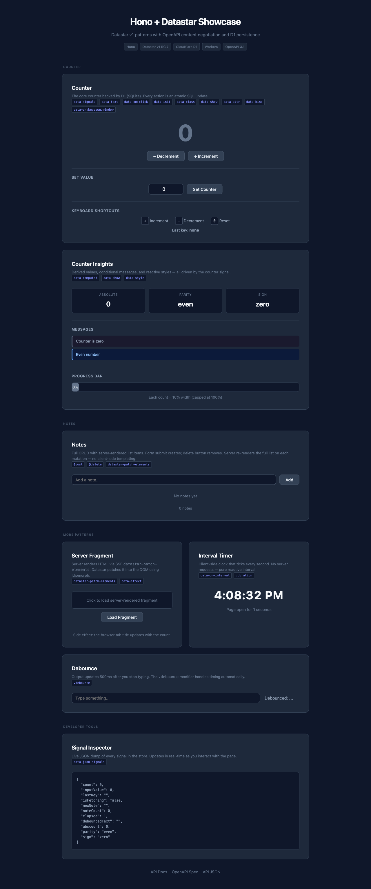
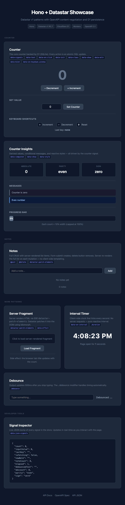
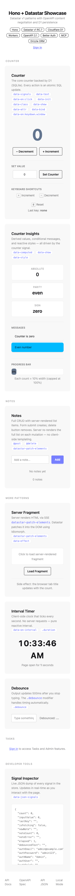

# test-hono

Hono + Datastar pattern showcase — dual-mode deployment to Cloudflare Workers (one-shot SSE) and Fly.io (persistent SSE with real-time broadcast). Same codebase, same tests, same frontend.

**repo** https://github.com/joeblew999/test-hono

**Local (Workers):** http://localhost:8787 — `task dev`

**Local (Bun):** http://localhost:3000 — `task fly:dev`

**Cloudflare Workers:** https://test-hono.gedw99.workers.dev

**Fly.io (persistent SSE):** https://test-hono-bun.fly.dev

[](https://deploy.workers.cloudflare.com/?url=https://github.com/joeblew999/test-hono)

| Desktop | Tablet | Mobile |
|---------|--------|--------|
|  |  |  |

## Stack

- [Hono](https://hono.dev) (OpenAPIHono) — API framework with Zod OpenAPI + [Scalar](https://scalar.com) API docs
- [Datastar](https://data-star.dev) v1.0.0-RC.7 — reactive frontend via SSE
- [Cloudflare Workers](https://developers.cloudflare.com/workers/) — serverless runtime (one-shot SSE)
- [Fly.io](https://fly.io) + [Bun](https://bun.sh) — persistent runtime (real-time SSE broadcast)
- [Cloudflare D1](https://developers.cloudflare.com/d1/) / bun:sqlite — SQLite on both platforms
- [Playwright](https://playwright.dev) — end-to-end tests (same 15 tests pass on all 4 targets)
- [Task](https://taskfile.dev) — task runner

## Prerequisites

Just install [Task](https://taskfile.dev) — everything else (Bun, npm packages, Playwright) is handled by `task deps`.

## Quick Start

### Cloudflare Workers (one-shot SSE)

```sh
task deps       # install Bun (if needed) + all dependencies
task dev        # start dev server with live logs (port 8787)
task test       # run 15 e2e tests
task deploy     # deploy to Cloudflare Workers
```

### Fly.io (persistent SSE with real-time broadcast)

```sh
task deps       # install Bun (if needed) + all dependencies
task fly:dev    # start Bun server with persistent SSE (port 3000)
task fly:test   # run same 15 e2e tests against Bun server
task fly:deploy # deploy to Fly.io (creates app + volume if needed)
```

Open http://localhost:8787 (Workers) or http://localhost:3000 (Bun) for the counter UI, append `/ui` for API docs (Scalar).

## Dual-Mode Architecture

This project runs on **two platforms from a single codebase** — no code duplication, no feature flags, no conditional imports. The same `api.ts`, `queries.ts`, and `index.html` work on both.

```
Cloudflare Workers (index.ts)          Fly.io / Bun (server.ts)
┌─────────────────────────┐            ┌─────────────────────────┐
│  D1 (Cloudflare SQLite) │            │  bun:sqlite (local)     │
│  One-shot SSE responses │            │  Persistent SSE streams │
│  Tabs sync on action    │            │  Real-time broadcast    │
└──────────┬──────────────┘            └──────────┬──────────────┘
           │                                      │
           └──────────┬───────────────────────────┘
                      │
              ┌───────┴────────┐
              │    api.ts      │  ← shared routes + content negotiation
              │  queries.ts    │  ← shared SQL (D1 interface)
              │  index.html    │  ← shared Datastar frontend
              │  15 Playwright │  ← shared tests
              │    tests       │
              └────────────────┘
```

### How it works

The `api.ts` factory accepts an optional `BroadcastConfig`:

```ts
// Workers: no broadcast → one-shot SSE (current behavior)
app.route('/api', api())

// Bun: broadcast provided → persistent SSE with real-time push
app.route('/api', api(broadcastConfig))
```

When broadcast is wired in:
- **GET /counter** (SSE) keeps the connection open and subscribes to changes
- **POST /counter/increment** writes to SQLite, responds to the caller, AND broadcasts to all open connections
- Tab B instantly sees Tab A's increment — no polling, no action needed

When broadcast is absent (Cloudflare Workers):
- Behavior is identical to before — one-shot SSE, tabs sync on their next action
- Zero overhead, zero code paths touched

### The D1 adapter trick

`queries.ts` is typed for Cloudflare's `D1Database` interface. Instead of rewriting queries for bun:sqlite, a thin adapter in `db.ts` makes bun:sqlite look like D1:

```ts
// db.ts — makes bun:sqlite speak D1
const d1 = createD1Compat(sqliteDb)
// queries.ts works unchanged: db.prepare(sql).bind(v).first<T>()
```

Result: **zero changes** to `queries.ts` across platforms.

### Real-time SSE in action

```
Tab A                          Bun Server                      Tab B
  │                                │                              │
  │── GET /api/counter (SSE) ─────>│                              │
  │<── event: count=0 ────────────│                              │
  │   (connection stays open)      │                              │
  │                                │<── GET /api/counter (SSE) ──│
  │                                │── event: count=0 ──────────>│
  │                                │   (stays open)               │
  │                                │                              │
  │── POST /increment ───────────>│                              │
  │<── one-shot SSE: count=1 ────│                              │
  │                                │── broadcast: count=1 ──────>│
  │                                │   (via persistent SSE)       │
  │                                │                              │
  │   Tab A shows 1               │              Tab B shows 1   │
```

## Commands

```
# Cloudflare Workers
task            # list all commands
task dev        # start dev server with logs (port 8787)
task start      # start server in background
task stop       # stop dev server
task test       # run 15 e2e tests headed + serial (real browser)
task test:ci    # run 15 e2e tests headless + parallel (fast, for CI)
task deploy     # deploy to Cloudflare Workers (runs remote migrations)
task test:deployed  # run e2e tests against deployed worker (headless)

# Fly.io (Bun + SQLite + persistent SSE)
task fly:dev    # start Bun server (port 3000, persistent SSE)
task fly:start  # start in background
task fly:stop   # stop Bun server
task fly:test   # run e2e tests headed against Bun server
task fly:deploy # deploy to Fly.io (creates app + volume if needed)
task fly:test:deployed  # run e2e tests against deployed Fly.io app (headless)
task fly:login  # authenticate with Fly.io
task fly:launch # create Fly.io app + volume (idempotent)

# Screenshots & setup
task screenshots    # capture screenshots at 3 viewports (mobile/tablet/desktop)
task db:create      # create remote D1 database (one-time)
task db:migrate     # apply migrations locally
task db:migrate:remote  # apply migrations to remote database
task login          # authenticate with Cloudflare
task ci:secrets     # set Cloudflare secrets in GitHub for CI
task deps           # install Bun + all dependencies
```

## CI Deployment

Push-triggered CI deploys need a Cloudflare API token. One-time setup:

```sh
task login                           # authenticate locally (browser)
# Create an API token at https://dash.cloudflare.com/profile/api-tokens
# → Use the "Edit Cloudflare Workers" template
task ci:secrets -- YOUR_API_TOKEN    # sets GitHub secrets automatically
```

After that, every push to `main` auto-deploys via GitHub Actions.

## Datastar Patterns Showcased

The index page demonstrates 20 Datastar v1 patterns across 8 sections grouped into 4 categories (Counter, Notes, More Patterns, Developer Tools):

| Pattern | Description |
|---------|-------------|
| `data-signals` | Reactive state store |
| `data-text` | Text binding |
| `data-on:click` | Event handlers with server actions (`@post`, `@delete`) |
| `data-init` | Initialization (fetch on load, setInterval) |
| `data-class` | Conditional CSS classes |
| `data-show` | Conditional visibility |
| `data-computed` | Derived signals |
| `data-bind` | Two-way input binding |
| `data-attr` | Conditional HTML attributes |
| `data-effect` | Reactive side effects |
| `data-style` | Reactive inline styles (width, background-color) |
| `data-json-signals` | Live JSON dump of all signals |
| `data-on:keydown.window` | Global keyboard listeners |
| `data-on:input.debounce` | Debounced input handler (`.debounce:500ms` modifier) |
| `@post` | Server action: POST request |
| `@delete` | Server action: DELETE request |
| `@get` | Server action: GET request |
| `datastar-patch-signals` | SSE event: update signal values |
| `datastar-patch-elements` | SSE event: patch DOM fragments via inner mode |
| Fragment `inner` mode | Replace element contents (most reliable for list re-renders) |

## Why This Matters

Most web stacks force you to choose: either you get a nice API (OpenAPI, typed schemas, auto-generated docs) or you get a reactive frontend (React, SvelteKit, Next.js). Combining both usually means duplicating every endpoint — one for the API, one for the UI — and pulling in a JavaScript framework with a build step, a virtual DOM, and a bundle measured in megabytes.

This project eliminates that tradeoff with **content negotiation**. A single set of OpenAPI routes serves both:

- **JSON** for API clients, Scalar "Try It", curl, and any external consumer
- **SSE** for the Datastar frontend, which reactively patches the DOM

The same `POST /api/counter/increment` endpoint that returns `{"count": 3}` to curl returns a `datastar-patch-signals` SSE event to the browser. One route definition. One Zod schema. One handler. Two audiences.

The frontend is **zero-build HTML** — no JSX, no bundler, no virtual DOM. Datastar attributes (`data-text`, `data-on:click`, `data-show`, `data-computed`) make the page reactive through declarative HTML. The entire frontend is a single `index.html` with no compilation step. Add a Datastar attribute, reload the page, done.

**The dual-mode breakthrough:** The same codebase deploys to both serverless (Cloudflare Workers) and persistent (Fly.io) runtimes. On Workers, SSE is one-shot — each request gets a response and the connection closes. On Fly.io, the same GET endpoint holds the connection open and broadcasts changes in real-time. The difference is a single optional parameter (`BroadcastConfig`) passed to the route factory. No `if` statements, no environment detection, no platform-specific code paths. Same routes, same frontend, same 15 tests — verified on all 4 targets (Workers local, Workers production, Bun local, Fly.io production).

| Traditional SPA | This project |
|----------------|-------------|
| React/Vue/Svelte + build step | Plain HTML + Datastar attributes |
| REST API + separate SSE/WebSocket layer | Single content-negotiated routes |
| Duplicate route definitions (API + frontend) | One set of OpenAPI routes |
| Client-side state management (Redux, Zustand) | Server state via SQLite + SSE signals |
| Hundreds of npm dependencies | ~4 runtime dependencies |
| One deployment target | Dual-mode: Workers (serverless) + Fly.io (persistent) |
| Polling or WebSockets for real-time | Persistent SSE broadcast (zero client-side code) |

## Design

- No Next.js. No Node.js. Just Bun + Hono + Datastar.
- Self-hosted Datastar v1 RC.7 (no CDN dependency).
- Type-safe API via Zod OpenAPI schemas.
- Content negotiation: same routes serve JSON (API) and SSE (Datastar).
- Dual-mode: Cloudflare Workers (D1, one-shot SSE) and Fly.io (bun:sqlite, persistent SSE).
- D1 adapter: bun:sqlite wrapped to match D1Database interface — zero query changes across platforms.
- Atomic increment/decrement using `UPDATE ... SET value = value + 1 RETURNING value`.
- Taskfile wraps everything for ease of use (all tasks are idempotent).
- All URLs are relative — same code runs locally and in production with no changes.

## File Structure

```
index.ts          # Cloudflare Workers entry point
server.ts         # Bun/Fly.io entry point (persistent SSE)
api.ts            # Route composer (imports from routes/)
types.ts          # Shared types: AppEnv, BroadcastConfig
sse.ts            # Reusable SSE helpers: respond, respondFragment, respondPersistent
routes/
  counter.ts      # Counter schemas, OpenAPI routes, handlers
  notes.ts        # Notes CRUD schemas, OpenAPI routes, handlers
queries.ts        # Shared D1-typed SQL queries
db.ts             # bun:sqlite → D1 adapter (Bun mode only)
docs.ts           # OpenAPI doc + Scalar mount helper
static/
  index.html      # Datastar frontend (8 sections, 20 patterns, responsive)
  datastar.js     # Self-hosted Datastar v1 RC.7
  datastar.js.map # Source map for browser debugging
tests/
  counter.spec.ts     # 9 counter e2e tests
  notes.spec.ts       # 6 notes/demo e2e tests
  screenshots.spec.ts # headed screenshot capture
docs/
  screenshots/        # auto-generated (task screenshots)
    mobile/           #   375×812 viewport
    tablet/           #   768×1024 viewport
    desktop/          #   1280×800 viewport
migrations/
  0001_init.sql   # Counter table (single-row pattern)
  0002_notes.sql  # Notes table
wrangler.toml     # Cloudflare Workers config
fly.toml          # Fly.io config
Dockerfile        # Bun container for Fly.io
playwright.config.ts       # Playwright config (excludes screenshots)
playwright.screenshots.ts  # Headed screenshot config
Taskfile.yml               # All dev/test/deploy commands
```

## Reference Repos

- [w3cj/hono-open-api-starter](https://github.com/w3cj/hono-open-api-starter) — Hono + Drizzle + Zod OpenAPI + Scalar starter (the community template)
- [w3cj/hono-node-deployment-examples](https://github.com/w3cj/hono-node-deployment-examples) — deploying Hono to Fly.io, Vercel, Cloudflare, etc.
- [superfly/corrosion](https://github.com/superfly/corrosion) — SQLite + CRDT replication + query subscriptions (the next step for multi-node real-time)

## FAQ

**Q: If I hit the API via Scalar "Try It" or curl, does the browser UI update?**

Yes (on Fly.io). API clients get JSON back (`Accept: application/json`), but the mutation still calls `bc?.broadcast()`, which pushes the new count to every open Datastar SSE connection. So `curl -X POST /api/counter/increment` returns `{"count": 3}` to the caller AND instantly updates all browser tabs. On Workers, the UI updates on its next action (one-shot SSE).

**Q: What's the difference between one-shot SSE and persistent SSE?**

One-shot (Workers): the server sends SSE events and closes the connection immediately. The browser gets the response and is done — it only sees new data when it makes another request (e.g. clicking increment). Persistent (Fly.io): the `GET /api/counter` connection stays open. The server pushes events whenever any client mutates the counter. Tabs sync in real-time without any user action.

**Q: Why can't Cloudflare Workers do persistent SSE?**

Workers are ephemeral isolates — they can't share I/O objects (like SSE streams) between request handlers. A POST from Tab A can't write to a stream opened by Tab B's GET. There's no module-level state that persists reliably across requests in production. Fly.io runs long-lived VMs where an in-process `Set<Listener>` works fine.

**Q: Why SSE instead of WebSockets?**

Datastar chose SSE as its wire format because it supports multiplexing — signals AND DOM fragments in one response via different event types (`datastar-patch-signals`, `datastar-patch-elements`). SSE also works through HTTP/2, requires no upgrade handshake, and reconnects automatically. For this project, SSE means the same response format works for both one-shot (Workers) and persistent (Fly.io) modes.

**Q: How does the D1 adapter work? Isn't bun:sqlite synchronous?**

Yes, bun:sqlite is synchronous. The adapter (`db.ts`) wraps synchronous calls to match D1's async interface — `stmt.get()` becomes `Promise.resolve(stmt.get())` behind `async first<T>()`. Since `queries.ts` uses `await db.prepare(sql).bind(v).first<T>()`, and awaiting an already-resolved promise is essentially free, the adapter adds zero overhead while keeping queries.ts unchanged across both platforms.

**Q: Can I add more tables/queries?**

Yes. Add migrations in `migrations/`, update `queries.ts` with new D1-typed functions, and add routes in `api.ts`. The same code runs on both platforms. For Bun mode, also add the `CREATE TABLE` statement in `db.ts`'s `initDB()` function (it runs inline migrations on startup).

**Q: How do I scale Fly.io beyond a single node?**

The current broadcast uses an in-process `Set<Listener>` — it works perfectly for a single VM. For multi-node, replace the in-process pub/sub with [Corrosion](https://github.com/superfly/corrosion) (SQLite + CRDT replication + query subscriptions). Subscribe to a SQL query, get pushed updates when the data changes across any node. The Datastar frontend stays identical — it already expects SSE.

**Q: Do I need both platforms? Can I use just one?**

Absolutely. Use Workers-only if you want serverless with zero infrastructure. Use Fly.io-only if you want persistent SSE and real-time broadcast. The dual-mode exists to show that the same codebase supports both — pick whichever fits your use case.

**Q: Why Datastar instead of React/Vue/Svelte?**

Zero build step. The frontend is a single HTML file with declarative attributes. No JSX, no virtual DOM, no bundler, no node_modules for the frontend. Datastar makes HTML reactive through attributes like `data-text`, `data-on:click`, `data-show`. The server sends SSE events, Datastar patches the DOM. The entire frontend weighs ~14KB (self-hosted JS).

**Q: Why is Datastar self-hosted instead of using a CDN?**

Version pinning. Datastar v1 RC.7 (Dec 2025) is a GitHub-only release — it's not on npm (npm latest is beta.11, which has a completely different API). Self-hosting `/static/datastar.js` ensures the frontend and backend always agree on the SSE event format. No CDN cache surprises, no version mismatches.

## Architecture Notes

See [docs/MEMORY.md](docs/MEMORY.md) for detailed learnings, especially around Cloudflare Workers I/O isolation constraints and the persistent SSE broadcast pattern.
